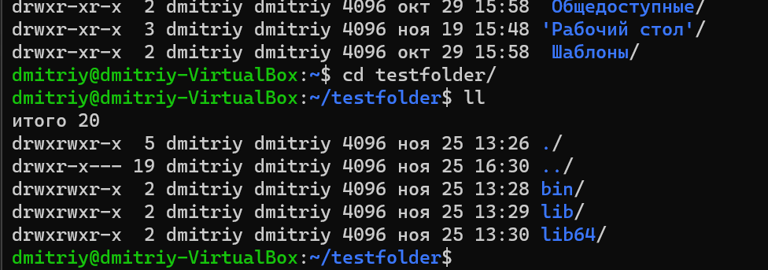
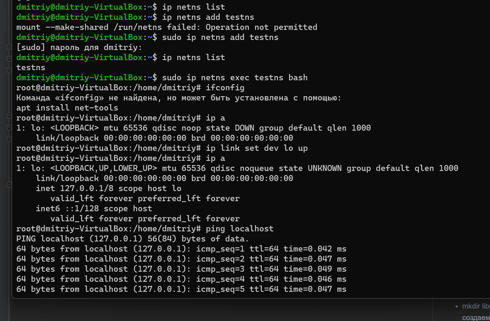
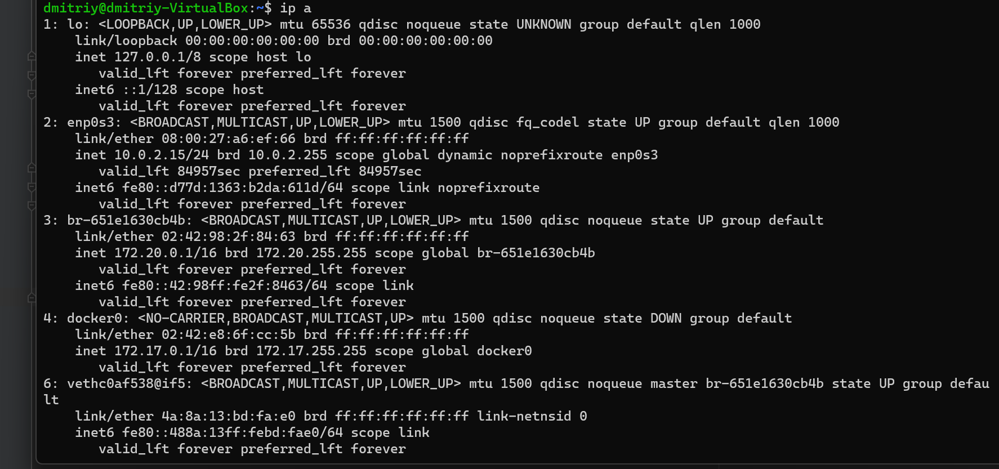
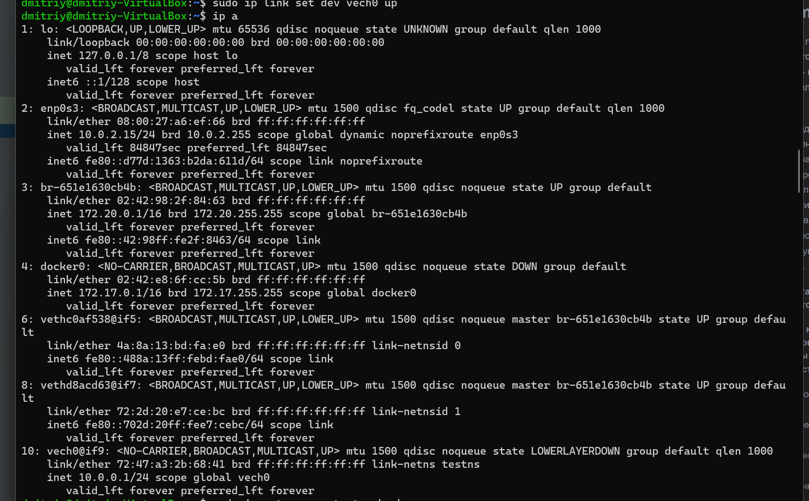
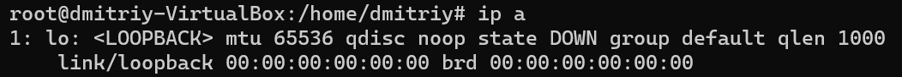
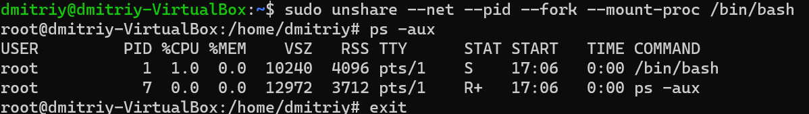

## Lesson1Seminar
Задание: необходимо продемонстрировать изоляцию одного и того же приложения (как решено на семинаре - командного интерпретатора) в различных пространствах имен.

Формат сдачи ДЗ: предоставить доказательства выполнения задания посредством ссылки на google-документ с правами на комментирование/редактирование.
Результатом работы будет: текст объяснения, логи выполнения, история команд и скриншоты (важно придерживаться такой последовательности).
В названии работы должны быть указаны ФИ, номер группы и номер урока.
##### Смена корневого каталога (полноценной изоляцией не является). 
##### При создании новой корневой директории нужно копировать все исполняемые файлы - рост объема дискового пространства.
* mkdir testfolder - создаем новую директорию 
* cd testfolder/ - переходим в созданную директорию
* mkdir bin - в созданной директории создаем каталог
* mkdir lib - в созданной директории создаем каталог
* mkdir lib64 - в созданной директории создаем каталог
* ldd /bin/bash - открыть список зависимостей

##### Копируем пути bash в созданную новую директорию
* cp /bin/bash testfolder/bin
* cp /lib/x86_64-linux-gnu/libtinfo.so.6 testfolder/lib
* cp /lib/x86_64-linux-gnu/libc.so.6 testfolder/lib
* cp /lib64/ld-linux-x86-64.so.2 testfolder/lib64
* sudo chroot testfolder - меняем пользователя
##### Создаем пространство имен и хост-систему

* ip netns list
* sudo ip netns add testns - Добавляет сетевое пространство имен с именем testns
* ip netns list
* sudo ip netns exec testns bash - запуск командного интерпретатора bash в пространстве имен testns
* sudo ip link add vech0 type veth peer name veth1 - добавить виртуальный сетевой интерфейс vech0 типа veth связанный с сетевым интерфейсом veth1
* sudo ip link set veth1 netns testns - назначить сетевой интерфейс veth1 пространству имён "testns"
* sudo ip addr add 10.0.0.1/24 dev vech0 - назначить сетевой адрес интерфейсу vech0
* sudo ip link set dev vech0 up - включить (поднять) сетевой интефейс vech0
* sudo ip netns exec testns bash - Эта команда запустит оболочку bash в указанном пространстве имён.
  
  
##### Изоляция на уровне процессов и сетевом уровне - unshare
    * Утилита unshare позволяет нам с помощью параметров создавать 
      разные уровни пространств имён и запускать в этом окружении переданную в качестве аргумента программу, 
      если её не передать запустится /bin/sh
* sudo unshare --net --pid --fork --mount-proc /bin/bash

### Студент GeekBrains Черняков Дмитрий урок 1 семинар