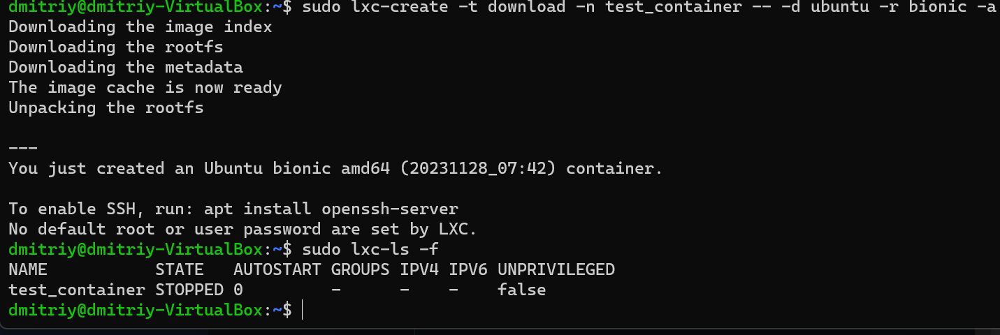
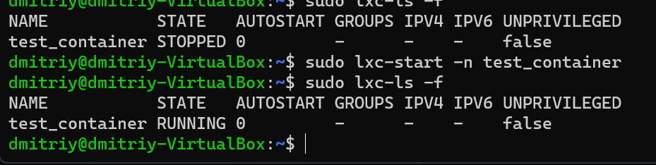
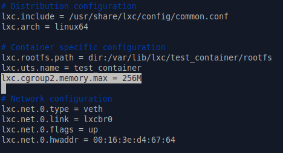
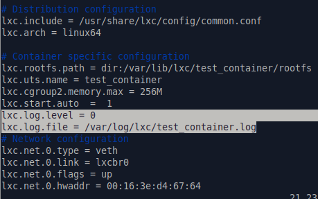

## Lesson2Seminar
Задание 1:
1) запустить контейнер с ubuntu, используя механизм LXC
2) ограничить контейнер 256 Мб ОЗУ и проверить, что ограничение работает
3) добавить автозапуск контейнеру, перезагрузить ОС и убедиться, что контейнер действительно запустился самостоятельно
4) при создании указать файл, куда записывать логи
5) после перезагрузки проанализировать логи

Задание 2*: настроить автоматическую маршрутизацию между контейнерами. Адреса можно взять: 10.0.12.0/24 и 10.0.13.0/24.

Задание со звездочкой - повышенной сложности, это нужно учесть при выполнении (но сделать его необходимо).

Формат сдачи ДЗ: предоставить доказательства выполнения задания посредством ссылки на google-документ с правами на комментирование/редактирование.
Результатом работы будет: текст объяснения, логи выполнения, история команд и скриншоты (важно придерживаться такой последовательности).
В названии работы должны быть указаны ФИ, номер группы и номер урока.
Подготовка системы для работы с lxc
----
Установим необходимые утилиты для работы с lxc

* sudo apt install lxc lxc-utils

Создание конейнера
#### Для создания контейнера воспользуемся утилитой lxc-create с параметрами

* sudo lxc-create -t download -n test_container -- -d ubuntu -r bionic -a amd64

#### Проверим что контейнер создан утилитой lxc-ls

* sudo lxc-ls -f

  
#### Запустим его с помощью утилиты lxc-start

* sudo lxc-start -n test_container  

#### После того как контейнер запущен, можно подключиться к оболочке утилитой lxc-attach

* sudo lxc-attach -n test_container
### Ограничение ресурсов контейнера на примере оперативной памяти
#### Для ограничения ресурсов контейнера, можно воспользоваться конфигурационным файлом.

* sudo vim /var/lib/lxc/test_container/config
 *      Отрывки из конфиг-файла

        # additional

        lxc.cgroup2.memory.max = 128M

        lxc.start.auto = 1

        # logging

        lxc.log.file = /home/HomeWork02/con1.log

        lxc.log.level = 1

#### Добавив параметр отвечающий за ограничение оперативной памяти.

### Настройка логирования
#### Для включения логирования нужно задать несколько параметров в конфигурационном файле.

#### Параметром lxc.log.level определяется уровень подробности логирования. Варианты:

      0 = trace
      1 = debug
      2 = info
      3 = notice
      4 = warn
      5 = error
      6 = critical
      7 = alert
      8 = fatal
#### Значение по умолчанию для этого парметра равно 5.

#### Параметром lxc.log.file задаётся файл, в который будет происходить запись.

#### Для применения настроек, контейнер нужно перезапустить, и можно следить за изменениями в лог файле.

* sudo tail -f /var/log/lxc/test_container.log