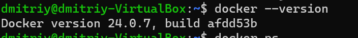
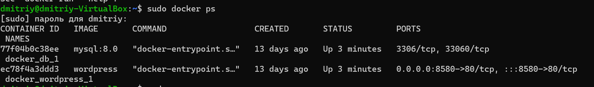
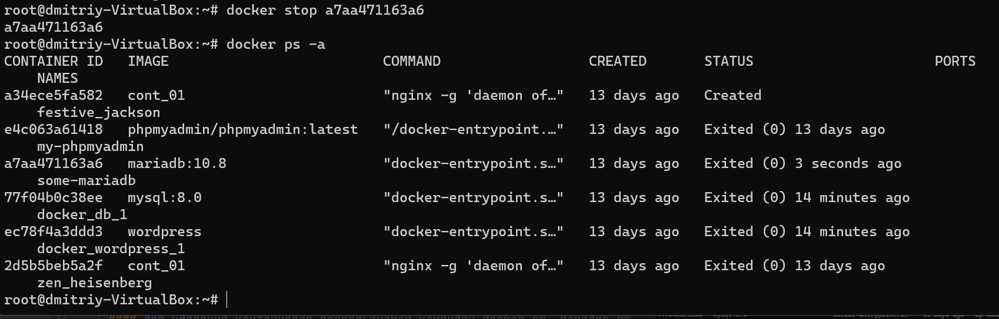
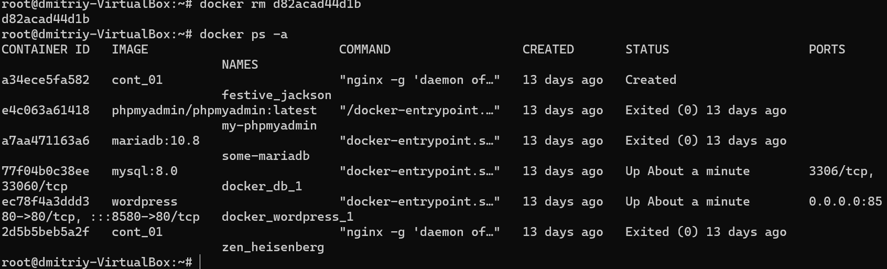
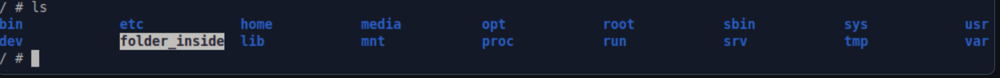

### Lesson3(Seminar)

Задание:
1) запустить контейнер с БД, отличной от mariaDB, используя инструкции на сайте: https://hub.docker.com/
2) добавить в контейнер hostname такой же, как hostname системы через переменную
3) заполнить БД данными через консоль
4) запустить phpmyadmin (в контейнере) и через веб проверить, что все введенные данные доступны

Формат сдачи ДЗ: предоставить доказательства выполнения задания посредством ссылки на google-документ с правами на комментирование/редактирование.
Результатом работы будет: текст объяснения, логи выполнения, история команд и скриншоты (важно придерживаться такой последовательности).
В названии работы должны быть указаны ФИ, номер группы и номер урока.

#### Проверим наличие утилиты docker в системе.

  - docker --version

#### Проверим что служба dockerd запущена и отвечает на запросы.
  
  - docker ps

### Управление контейнерами и образами с помощью утилиты docker
#### для создания и запуска контейнера воспользуемся командой docker run

   - docker run hello-world

#### в случае если мы хотим запустить уже существующий контейнер, то можно воспользоваться командой docker start, передав в качестве аргумента имя контейнера или его ID.
#### для остановки контейнера воспользуемся командой docker stop, передав в качестве аргумента имя или ID контейнера.

   - docker stop b7a940df2b9

#### для удаления контейнеров воспользуемся командой docker rm, передав в качестве аргумента имя или ID контейнера.

   - docker rm b7a940df2b94

### Хранение данных в контейнерах docker
#### При создании контейнера, ему выделяется своя собственная файловая система, которая будет хранить информацию во время существования контейнера, а при его удалении будет стёрта. Для того чтобы избежать потери данных предусмотрен механизм монтирования данных внутрь файловой системы контейнера.

#### мы можем указать для монтирования любую существующую директорию, например, создадим директорию testfolder и укажем её в качестве аргумента при создании контейнера

- docker run -it -v ./testfolder:/folder_inside alpine
  
  Как видно на скриншоте, в файловой системе контейнера появилась новая директория.

теперь мы можем работать с этой директорией изнутри контейнера, например создадим там файл и проверим, что мы можем его увидеть из хостовой системы
 Запускаем mariaDb
 
 - docker network creat my_network
- docker run -d --name db --network my_network -e MYSQL_ROOT_PASSWORD=13254689 mariadb:10.8
- docker run -d --name myadmin --network my_network -e PMA_HOST=db -p 9000:80 phpmyadmin
  
### Студент GeekBrains Черняков Дмитрий урок 3 семинар