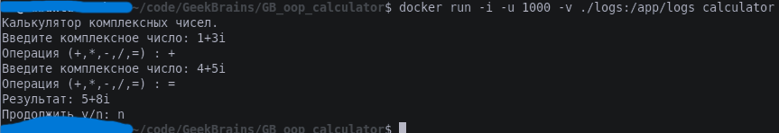

### LessonSeminar4

Сам Dockerfile это набор инструкций которые будут выполнены для сборки образа.

создадим файл с именем Dockerfile

* touch Dockerfile

начнем c добавления базового образа с помощью инструкции FROM
*     FROM ubuntu:22.04
      RUN apk update && apk --no-cache add openjdk17-jdk=17.0.8_p7-r0 maven=3.9.2-r0
      RUN echo 'Hi, I am in your container' \
      >/usr/share/nginx/html/index.html
      EXPOSE 5100
      CMD ["nginx", "-g", "daemon off;"]
#### инструкция RUN позволяет выполнить команду внутри контейнера, например, установить необходимые пакеты:

* RUN apk update && apk --no-cache install bash

#### Т.к. каждая инструкция RUN добавляет слой изменений в образ, можно объединять команды с помощью && для облегчения итогового образа.

#### инструкция WORKDIR задаёт директорию выполнения команд.

* WORKDIR /app

#### Эту инструкцию можно использовать несколько раз, если нужно выполнить команды в определённой директории.

#### инструкция COPY позволяет скопировать данные из внешней файловой системы, нужно учесть что при сборке образа докер демон получит информацию только о текущем каталоге и подкаталогах, поднятся на уровень выше он не может. Т.е. нельзя указать в параметрах COPY путь "../src".

* COPY . /app

#### Эта команда скопирует все содержимое текущего каталога в папку /app внутри контейнера. На этом этапе следует учитывать, что докер демону передаётся вся информация из текущей директории, и если там есть данные не нужные для сборки контейнера, их можно перечислить в файле .dockerignore

#### инструкция CMD позволяет задать выполнение команды, после создания контейнера на основе нашего образа

 * CMD ["bash"]

#### Так же можно задавать несколько аргументов, перечислив их через запятую.

#### инструкция ENTRYPOINT позволяет задать команду, которая будет являтся точков входа, и которой можно будет передать внешние аргументы при запуске.

#### ENTRYPOINT ["bash"]
#### Задаем базовый образ, и через AS задаем имя, по которму сможем потом к нему обратиться

* RUN apk update && apk --no-cache add openjdk17-jdk=17.0.8_p7-r0 maven=3.9.2-r0

#### Обновляем списки пакетов, и устанавливаем необходимые для сборки с указанием версий.

* COPY . .

#### Копируем файлы проекта в текущую директорию образа.

* RUN mvn package

#### Запускаем сборку проекта в текущей директории.

#### создание образа со средой выполнения, и копирование туда скомпилированного кода из сборщика

* FROM ubuntu:22.04

#### Задаем базовый образ, для построения контейнера.

* RUN apk update && apk --no-cache add openjdk17-jre=17.0.8_p7-r0

#### Обновляем и устанавливаем пакеты для исполнения приложения.

* COPY --from=builder /target/*jar-with-dependencies.jar /app/app.jar

#### Копируем скомпилированный файл в папку внутри образа.

* WORKDIR /app

#### Задаем рабочую директорию для выполения команд.

* RUN mkdir logs && chown 1000:1000 logs

#### Создаем папку logs и переназначаем права, для возможности работы от непривилегированного пользователя.

* CMD ["java", "-jar", "app.jar"]

#### Задаем команду для выполнения приложения в контейнере

#### запускаем сборку образа

* docker build -t calculator .

#### после завершения сборки запускаем контейнер с приложением

* docker run -i -u 1000 -v ./logs:/app/logs calculator

#### В команде запуска задаём параметр "-i" т.к. приложение консольное и для работы понадобится интерактивный режим, задаем пользователя, для работы в непривелигированном режиме параметром "-u 1000", так же в приложении используется логирование в файл, поэтому добавим монтирование директории "-v ./logs:/app/logs calculator"

В качестве примера я буду использовать следующий проект:
https://github.com/Kingofhell1/Lesson7Group4720.git
