### Lesson5Seminar
#### Запускаем сервисы используя docker-compose
#### Для работы docker-compose нужен файл с инструкция в формате yml, в нашем случае это будет docker-compose.yml (docker-compose.yml - это значение по умолчанию для файла конфигурации, в случае если мы не укажем имя файла при запуске утилиты, будет задействоваи файл с таким именем)

#### создадим файл docker-compose.yml

* touch docker-compose.yml

#### добавим содержимое учитывая синтаксис yml

    
    Services:
       wordpress:
          image: wordpress
          restart: always
          ports:
            - 8580:80
          environment:
           WORDPRESS_DB_HOST: db
           WORDPRESS_DB_USER: exampleuser
           WORDPRESS_DB_PASSWORD: examplepass
           WORDPRESS_DB_NAME: exampledb
          volumes:
            - wordpress:/var/www/html

        db:
           image: mysql:8.0
            restart: always
            environment:
              MYSQL_DATABASE: exampledb
              MYSQL_USER: exampleuser
              MYSQL_PASSWORD: examplepass
               MYSQL_RANDOM_ROOT_PASSWORD: '1'
       volumes:
          - db:/var/lib/mysql

      volumes:
         wordpress:
         db:
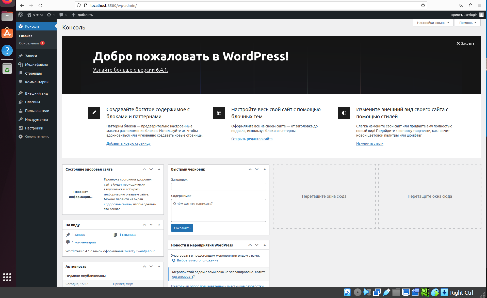
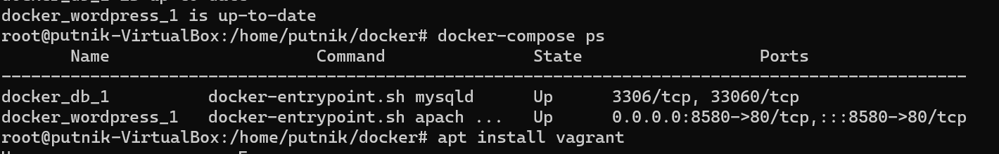
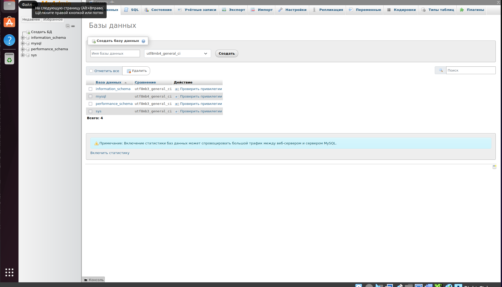
#### Оба контейнера успешно запустились, проверить работоспособность можно обратившись на порт 8580.
### Подготовка и запуск docker swarm кластера из 3-х виртуальных машин
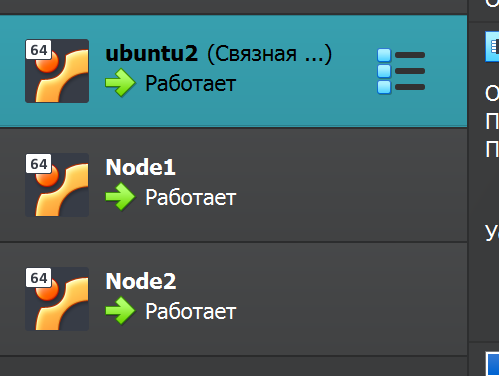
#### подключимся по ssh на node2 и node3 и выполним команду подключения к кластеру с ролью manager
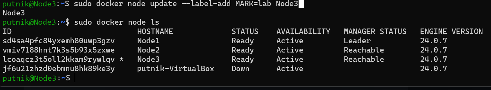
Для соединение вирутальных машин между друг-другом используем на главном manager команду:
* sudo docker swarm init

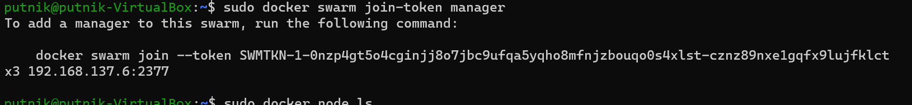

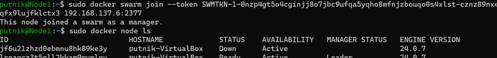
### Развёртывание сервисов в кластер
#### Для публикации сервисов, нам понадобится yml файл с инструкциями, которые мы будем передавать при развёртывании сервисов.

#### Для разграничения запуска контейнеров по серверам, добавим label для каждой ноды

* docker node update --label-add MARK=dev Node1

* docker node update --label-add MARK=prod Node2

* docker node update --label-add MARK=lab Node3
#### Создадим 3 файла для разделения окружений

* touch docker-compose.dev.yml docker-compose.prod.yml docker-compose.lab.yml
#### добавим содержимое в файлы на основе docker-compose.yml
*       version: '3'

       services:
         db:
           image: mariadb
           environment:
             MARIADB_ROOT_PASSWORD: passworddev
           deploy:
             placement:
               constraints:
                 - "node.labels.MARK==dev"

         phpmyadmin:
           image: phpmyadmin
           ports:
             - 8080:80
           deploy:
             placement:
               constraints:
                  - "node.labels.MARK==dev"

*     version: '3'

       services:
         db:
           image: mariadb
           environment:
             MARIADB_ROOT_PASSWORD: passworddev
           deploy:
             placement:
               constraints:
                 - "node.labels.MARK==prod"

         phpmyadmin:
           image: phpmyadmin
           ports:
             - 80:80
           deploy:
             placement:
               constraints:
                  - "node.labels.MARK==prod"
*     version: '3'

       services:
         db:
           image: mariadb
           environment:
             MARIADB_ROOT_PASSWORD: passworddev
           deploy:
             placement:
               constraints:
                 - "node.labels.MARK==lab"

         phpmyadmin:
           image: phpmyadmin
           ports:
             - 8081:80
           deploy:
             placement:
               constraints:
                  - "node.labels.MARK==lab"
#### развернем сервисы каждый в своём окружении

* docker stack deploy -c docker-compose.lab.yml lab

* docker stack deploy -c docker-compose.prod.yml prod

* docker stack deploy -c docker-compose.dev.yml dev

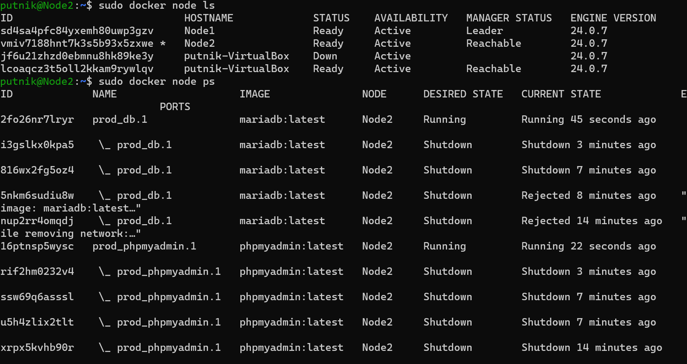

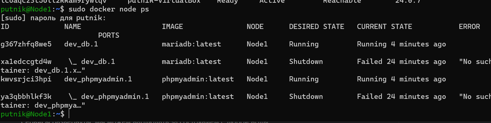

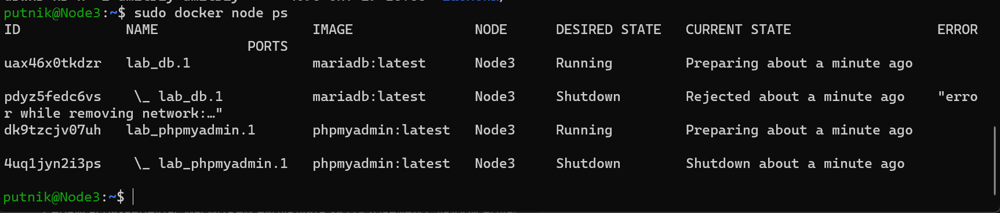

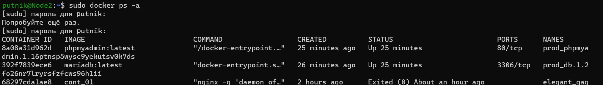

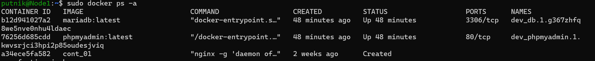

### Студент GeekBrains Симбирев Валерий урок 5 семинар